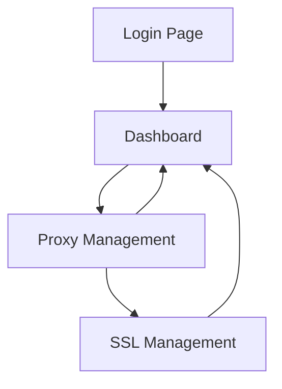

# Nginx Proxy Manager - Product Requirements Document

## 1. Product Overview

A minimal nginx proxy manager that enables users to easily configure reverse proxies with automatic SSL certificate management through Let's Encrypt. The system provides a web-based interface for managing domain-to-service mappings with built-in security features.

The product solves the complexity of manually configuring nginx reverse proxies and SSL certificates, targeting developers and system administrators who need to quickly expose internal services through custom domains with HTTPS support.

## 2. Core Features

### 2.1 User Roles

| Role | Registration Method | Core Permissions |
|------|---------------------|------------------|
| Admin User | Email registration with password | Full access to proxy management, SSL configuration, and system settings |

### 2.2 Feature Module

Our nginx proxy manager consists of the following main pages:

1. **Login page**: user authentication form, password validation.
2. **Dashboard page**: proxy list overview, quick actions, system status.
3. **Proxy management page**: add/edit proxy forms, domain configuration, target service settings.
4. **SSL management page**: certificate status, auto-renewal settings, manual certificate actions.

### 2.3 Page Details

| Page Name | Module Name | Feature description |
|-----------|-------------|---------------------|
| Login page | Authentication form | Validate user credentials using JWT tokens, secure password handling with bcrypt |
| Dashboard page | Proxy overview | Display active proxies, SSL status indicators, system health metrics |
| Dashboard page | Quick actions | Add new proxy button, refresh status, bulk operations |
| Proxy management page | Proxy form | Create/edit proxy configurations with domain, target URL, SSL toggle |
| Proxy management page | Proxy list | View all configured proxies, edit/delete actions, status indicators |
| SSL management page | Certificate status | Display SSL certificate validity, expiration dates, renewal status |
| SSL management page | Auto-renewal settings | Configure automatic certificate renewal, view renewal logs |

## 3. Core Process

**Admin User Flow:**
1. User logs in with email and password
2. Dashboard displays current proxy configurations and SSL status
3. User creates new proxy by specifying domain and target service
4. System automatically generates nginx configuration
5. If SSL is enabled, system requests Let's Encrypt certificate
6. Nginx configuration is reloaded with new proxy settings
7. Background process handles automatic SSL certificate renewal

## 4. User Interface Design

### 4.1 Design Style

- **Primary colors**: Blue (#3B82F6) for primary actions, Green (#10B981) for success states
- **Secondary colors**: Gray (#6B7280) for secondary text, Red (#EF4444) for errors
- **Button style**: Rounded corners with subtle shadows, consistent padding
- **Font**: Inter or system fonts, 14px base size, 16px for headings
- **Layout style**: Clean card-based design with top navigation, responsive grid layout
- **Icons**: Lucide React icons for consistency, minimal and modern style

### 4.2 Page Design Overview

| Page Name | Module Name | UI Elements |
|-----------|-------------|-------------|
| Login page | Authentication form | Centered card layout, input fields with validation states, primary blue submit button |
| Dashboard page | Proxy overview | Grid layout with status cards, green/red indicators for SSL status, clean typography |
| Dashboard page | Quick actions | Floating action button for adding proxies, toolbar with refresh and settings |
| Proxy management page | Proxy form | Modal or side panel form, toggle switches for SSL, validation feedback |
| Proxy management page | Proxy list | Table with sortable columns, action buttons, status badges |
| SSL management page | Certificate status | Status cards with expiration timers, progress indicators for renewal |
| SSL management page | Auto-renewal settings | Toggle switches, configuration panels, log viewer with monospace font |

### 4.3 Responsiveness

Desktop-first design with mobile-adaptive layout. Touch-friendly buttons and form elements for tablet/mobile usage. Responsive navigation that collapses on smaller screens.