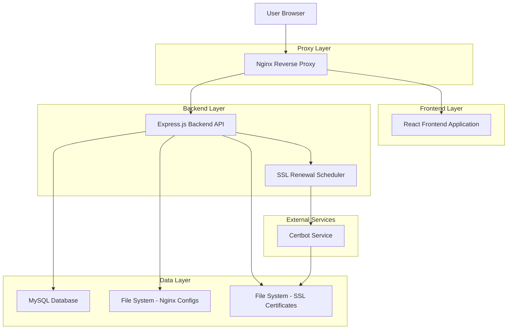
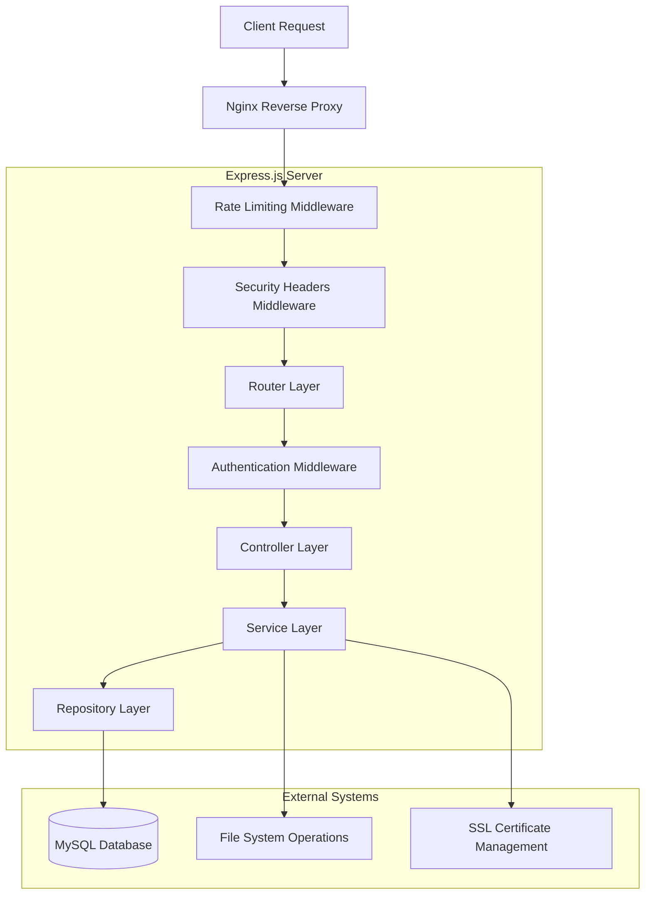
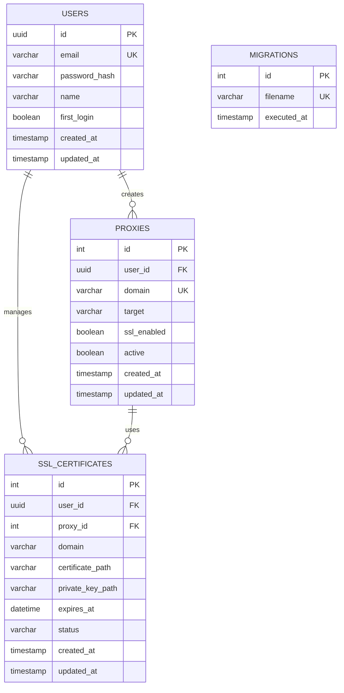

## 1. Architecture Design



## 2. Technology Description

- **Frontend**: React@18 + TypeScript + Vite + Tailwind CSS + Radix UI
- **Backend**: Express.js@4 + TypeScript + Node.js
- **Database**: MySQL@8.0
- **Proxy**: Nginx (Alpine)
- **SSL Management**: Certbot + Let's Encrypt
- **Containerization**: Docker + Docker Compose
- **Authentication**: JWT + bcrypt

## 3. Route Definitions

| Route | Purpose |
|-------|----------|
| / | Home page, redirects to dashboard or login |
| /login | User authentication page |
| /register | User registration page (admin only) |
| /dashboard | Main dashboard with proxy management |
| /change-password | Password change form for first-time users |

## 4. API Definitions

### 4.1 Core API

**Authentication Endpoints**

```
POST /api/auth/login
```

Request:
| Param Name | Param Type | isRequired | Description |
|------------|------------|------------|--------------|
| email | string | true | User email address |
| password | string | true | User password |

Response:
| Param Name | Param Type | Description |
|------------|------------|-------------|
| success | boolean | Login status |
| token | string | JWT authentication token |
| user | object | User information |

Example:
```json
{
  "email": "admin@example.com",
  "password": "securepassword123"
}
```

```
POST /api/auth/register
```

Request:
| Param Name | Param Type | isRequired | Description |
|------------|------------|------------|--------------|
| email | string | true | User email address |
| password | string | true | User password |
| name | string | true | User full name |

Response:
| Param Name | Param Type | Description |
|------------|------------|-------------|
| success | boolean | Registration status |
| message | string | Success/error message |

```
GET /api/auth/me
```

Response:
| Param Name | Param Type | Description |
|------------|------------|-------------|
| success | boolean | Request status |
| user | object | Current user information |

```
POST /api/auth/change-password
```

Request:
| Param Name | Param Type | isRequired | Description |
|------------|------------|------------|--------------|
| currentPassword | string | true | Current password |
| newPassword | string | true | New password |
| email | string | false | Updated email |
| name | string | false | Updated name |

**Proxy Management Endpoints**

```
GET /api/proxies
```

Response:
| Param Name | Param Type | Description |
|------------|------------|-------------|
| success | boolean | Request status |
| proxies | array | List of proxy configurations |

```
POST /api/proxies
```

Request:
| Param Name | Param Type | isRequired | Description |
|------------|------------|------------|--------------|
| domain | string | true | Domain name |
| target | string | true | Target URL |
| ssl_enabled | boolean | false | SSL configuration |

```
PUT /api/proxies/:id
```

Request:
| Param Name | Param Type | isRequired | Description |
|------------|------------|------------|--------------|
| domain | string | true | Domain name |
| target | string | true | Target URL |
| ssl_enabled | boolean | false | SSL configuration |

```
DELETE /api/proxies/:id
```

Response:
| Param Name | Param Type | Description |
|------------|------------|-------------|
| success | boolean | Deletion status |
| message | string | Success/error message |

**SSL Certificate Endpoints**

```
GET /api/ssl/certificates
```

Response:
| Param Name | Param Type | Description |
|------------|------------|-------------|
| success | boolean | Request status |
| certificates | array | List of SSL certificates |

```
POST /api/ssl/generate
```

Request:
| Param Name | Param Type | isRequired | Description |
|------------|------------|------------|--------------|
| domain | string | true | Domain name |
| email | string | true | Contact email |

```
POST /api/ssl/renew
```

Request:
| Param Name | Param Type | isRequired | Description |
|------------|------------|------------|--------------|
| domain | string | true | Domain name |

## 5. Server Architecture Diagram



## 6. Data Model

### 6.1 Data Model Definition



### 6.2 Data Definition Language

**Users Table**
```sql
-- Create users table
CREATE TABLE users (
    id CHAR(36) PRIMARY KEY DEFAULT (UUID()),
    email VARCHAR(255) UNIQUE NOT NULL,
    password_hash VARCHAR(255) NOT NULL,
    name VARCHAR(100) NOT NULL,
    first_login BOOLEAN DEFAULT TRUE,
    created_at TIMESTAMP DEFAULT CURRENT_TIMESTAMP,
    updated_at TIMESTAMP DEFAULT CURRENT_TIMESTAMP ON UPDATE CURRENT_TIMESTAMP
);

-- Create indexes
CREATE INDEX idx_users_email ON users(email);
CREATE INDEX idx_users_created_at ON users(created_at);

-- Insert default admin user
INSERT INTO users (email, password_hash, name, first_login) 
VALUES (
    'admin@example.com', 
    '$2b$10$example_hashed_password', 
    'Administrator', 
    TRUE
);
```

**Proxies Table**
```sql
-- Create proxies table
CREATE TABLE proxies (
    id INT AUTO_INCREMENT PRIMARY KEY,
    user_id CHAR(36) NOT NULL,
    domain VARCHAR(255) UNIQUE NOT NULL,
    target VARCHAR(500) NOT NULL,
    ssl_enabled BOOLEAN DEFAULT FALSE,
    active BOOLEAN DEFAULT TRUE,
    created_at TIMESTAMP DEFAULT CURRENT_TIMESTAMP,
    updated_at TIMESTAMP DEFAULT CURRENT_TIMESTAMP ON UPDATE CURRENT_TIMESTAMP,
    FOREIGN KEY (user_id) REFERENCES users(id) ON DELETE CASCADE
);

-- Create indexes
CREATE INDEX idx_proxies_user_id ON proxies(user_id);
CREATE INDEX idx_proxies_domain ON proxies(domain);
CREATE INDEX idx_proxies_active ON proxies(active);
CREATE INDEX idx_proxies_created_at ON proxies(created_at);
```

**SSL Certificates Table**
```sql
-- Create ssl_certificates table
CREATE TABLE ssl_certificates (
    id INT AUTO_INCREMENT PRIMARY KEY,
    user_id CHAR(36) NOT NULL,
    proxy_id INT,
    domain VARCHAR(255) NOT NULL,
    certificate_path VARCHAR(500),
    private_key_path VARCHAR(500),
    expires_at DATETIME,
    status ENUM('pending', 'active', 'expired', 'failed') DEFAULT 'pending',
    created_at TIMESTAMP DEFAULT CURRENT_TIMESTAMP,
    updated_at TIMESTAMP DEFAULT CURRENT_TIMESTAMP ON UPDATE CURRENT_TIMESTAMP,
    FOREIGN KEY (user_id) REFERENCES users(id) ON DELETE CASCADE,
    FOREIGN KEY (proxy_id) REFERENCES proxies(id) ON DELETE SET NULL
);

-- Create indexes
CREATE INDEX idx_ssl_certificates_user_id ON ssl_certificates(user_id);
CREATE INDEX idx_ssl_certificates_proxy_id ON ssl_certificates(proxy_id);
CREATE INDEX idx_ssl_certificates_domain ON ssl_certificates(domain);
CREATE INDEX idx_ssl_certificates_status ON ssl_certificates(status);
CREATE INDEX idx_ssl_certificates_expires_at ON ssl_certificates(expires_at);
```

**Migrations Table**
```sql
-- Create migrations table
CREATE TABLE migrations (
    id INT AUTO_INCREMENT PRIMARY KEY,
    filename VARCHAR(255) UNIQUE NOT NULL,
    executed_at TIMESTAMP DEFAULT CURRENT_TIMESTAMP
);

-- Create index
CREATE INDEX idx_migrations_filename ON migrations(filename);
CREATE INDEX idx_migrations_executed_at ON migrations(executed_at);
```

**Database Initialization Script**
```sql
-- Create database
CREATE DATABASE IF NOT EXISTS nginx_proxy_manager CHARACTER SET utf8mb4 COLLATE utf8mb4_unicode_ci;
USE nginx_proxy_manager;

-- Set proper SQL mode for production
SET sql_mode = 'STRICT_TRANS_TABLES,NO_ZERO_DATE,NO_ZERO_IN_DATE,ERROR_FOR_DIVISION_BY_ZERO';

-- Create all tables (execute the above CREATE TABLE statements)

-- Insert initial data
INSERT INTO migrations (filename) VALUES 
('001_create_users_table.sql'),
('002_create_proxies_table.sql'),
('003_create_ssl_certificates_table.sql');
```